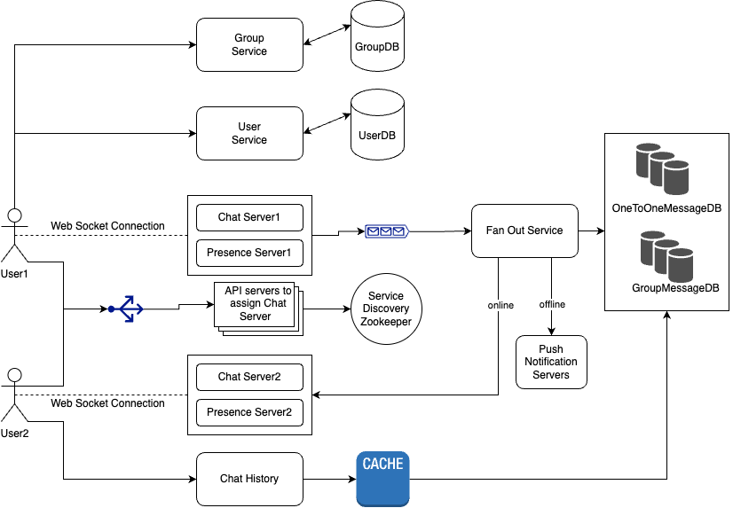

## Chat System Design

### Functional Requirements
1. System should support chat between 2 people as well as group chat.
2. User should be able to create Group and it can consist of maximum 100 people.
3. User should be able to see presence status i.e online, last seen of friends.
4. User can see history of chats in cronological order.
5. User should be able to send and receive messages, media in real time.
6. If user is offline, he should be notified about incoming messages.

### Non Functional Requirements
1. Scalabilty: lets assume 1 billion users with each user sending 100 messages daily.
2. Consistent and Fault tolerant.
3. Users should be able to send and receive messages with minimum latency.

### Back of Envelope Estimation
1. Average message size = 100 bytes(including metadata)
2. Storage = 1 billion * 100 * 100 bytes = 10 TB per day ~ 4 PB per year

### Communication Between Client and servers Design
**Stateful Services** 
1. **Chat servers**: For send/receive messages between client and chat servers, instead of using http requests or short polling or long polling we can use web sockets as it is bidirectional communication.
2. **Presence servers**: Similarly for presence updates, use of heartbeat mechanism will be better where client send heartbeat events event 5s to presence servers, if server doesn't receive hearbeat within next 30s client will be considered offline.

**Stateless Services**
1. User Service - login, User Profile
> - POST /api/v1/user/new
> - Request Body Parametres => name, email, phone, password
> - Returns userID

2. Group Service - create group, add User to group, remove user from group 
> - POST /api/v1/createGroup
> - Request Body Parametres => Group Name, Admin UserId, List{Users}
> - Returns groupID

3. Chat History Service
> - GET /api/v1/chats?{userId}

### Database Design
1. UserDB
- Schema -> {UserID, name, email, phone, password, imageURL, aboutContent}
- MySQL, Sharded on userId

2. GroupDB
- Schema -> {GroupID, name, password, imageURL, aboutContent, List of Users}

3. OnetoOneMessageDB
- Schema -> {messageID, content, messageFrom, messageTo, timestamp}
- Key Value DB or Hbase, sorted on messageID, timestamp
- Also assign UUID for idempotency of message pushing

4. GroupMessageDB
- Schema -> {messageID, GroupId, content, messageFrom, timestamp}
- Key Value DB or Hbase, Partitioned on GroupId, sorted on messageID, timestamp
- Also assign UUID for idempotency of message pushing

### System GoThrough
1. **Service Discovery**
> - User tries to login to the app.
> - The load balancer sends the login request to API servers.
> - After the backend authenticates the user, service discovery using zookeeper finds the best chat server and presence server for User. 
> - User connects to respective chat server and presence servers through WebSocket.

2. **Message Flow**
> - User 1 sends a chat message to Chat server1 via web socket connection.
> - Chat server1 sends the message to the message sync queue.
> - The message is stored in a key-value store.
> - If User2 is online, the message is forwarded to Chat server2 where User2 is connected via web socket.
> - If User2 is offline, a push notification is sent from push notification (PN) servers.