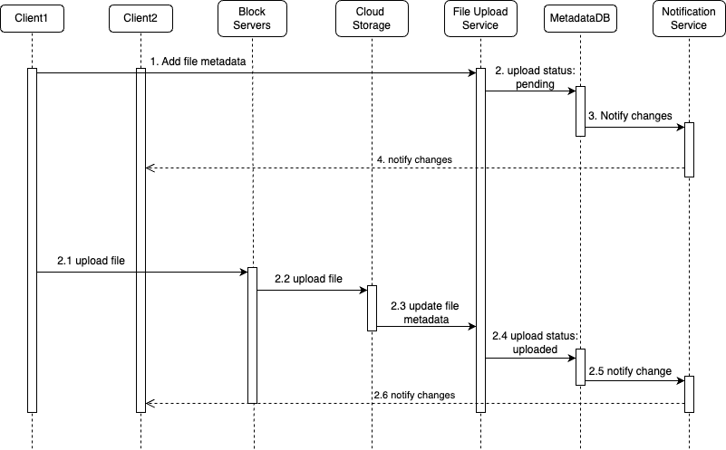
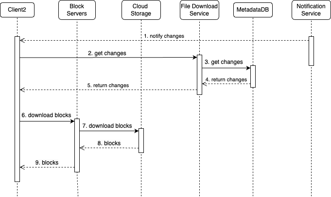
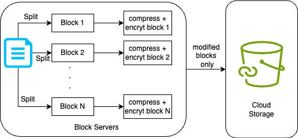

## Google Drive System Design

### Functional Requirements
1. Add and download files.
2. Sync files across multiple devices. When a file is added to one device, it is automatically synced to other devices.
3. See file revisions i.e older versions.
4. Share files with other users.
5. Send a notification when a file is edited, deleted, or shared with you.

### Non Functional Requirements
1. **Reliability**: Reliability is extremely important for a storage system. Data loss is unacceptable.
2. **Fast sync speed**: If file sync takes too much time, users will become impatient and abandon the product.
3. **Scalability**: The system should be able to handle high volumes of traffic.
4. **High availability**: Users should still be able to use the system when some servers ar offline, slowed down, or have unexpected network errors.

### Back of the envelope estimation
- Assume the application has 50 million signed up users and 10 million DAU.
- Users get 10 GB free space.
- Assume users upload 2 files per day. The average file size is 500 KB.
- 1:1 read to write ratio.
- Total space allocated: 50 million * 10 GB = 500 Petabyte
- QPS for upload API: 10 million * 2 uploads / 24 hours / 3600 seconds = ~ 240
- Peak QPS = QPS * 2 = 480

### API Design
1. **Upload a file to Google Drive**: Two types of uploads are supported
- Simple upload: Use this upload type when the file size is small.
- Resumable upload: Use this upload type when the file size is large and there is high chance of network interruption. A resumable upload is achieved by the following steps : Send the initial request to retrieve the resumable URL. Upload the data and monitor upload state. If upload is disturbed, resume the upload.
- POST /api/v1/files/upload?uploadType=resumable
- RequestBody : { data: Local file to be uploaded }

2. **Download a file from Google Drive**
- GET /api/v1/files/download
- RequestBody: { path: download file path }

3. **Get file revisions**
- POST /api/v1/files/list_revisions
- RequestParams: { path: The path to the file you want to get the revision history, limit: The maximum number of revisions to return }

### Database Design
1. UserDB
- Schema -> {userId, name, email, passwordHash ...}
- MySQL: shard + index on userId

2. UserDeviceDB
- Schema -> {userId, deviceId, lastLoggedIn}
- MySQL: shard on userId

3. FilePermissionsDB
- Schema -> {userId, docId}
- MySQL: shard + index on userId

4. FileDetailsDB
- Schema -> {fileId, fileName, relativePath, latestVersion, createdAt, lastUpdated}
- MySQL: Shard by fileId

5. FileVersionDB
- Schema -> {id, fileId, versionNumber createdAt}

5. FileBlockMetadataDB
- Schema -> {fileId, versionId, blockHash, URL}
- MySQL: partition on fileId to get all blocks of file on same node
- Indexing on fileId + versionId

6. FileBlock Storage
- A blob storage system is used to store blocks of files
- S3: less expensive, option2 can be HDFS: offers better data locality but expensive

### File Upload Flow
Instead of uploading a file as one unit, split file into smaller blocks.
- Pros: parallel uploading to S3, only load modified blocks on file changes
- Cons: Added complexity on client's end to do file diff, also have to keep track of file blocks in DB.

##### Add file metadata
> 1. Client 1 sends a request to add the metadata of the new file.
> 2. Store the new file metadata in metadata DB and change the file upload status to “pending”.
> 3. Notify the notification service that a new file is being added.
> 4. The notification service notifies relevant clients (client 2) that a file is being uploaded.

##### Upload files to cloud storage
> 2.1 Client 1 uploads the content of the file to block servers. 
> 2.2 Block servers chunk the files into blocks, compress, encrypt the blocks, and upload them to cloud storage. 
> 2.3 Once the file is uploaded, cloud storage triggers upload completion callback. The request is sent to API servers. 
> 2.4 File status changed to “uploaded” in Metadata DB. 
> 2.5 Notify the notification service that a file status is changed to “uploaded” 
> 2.6 The notification service notifies relevant clients (client 2) that a file is fully uploaded. 

### File Download Flow
> 1. Notification service informs client 2 that a file is changed somewhere else.
> 2. Once client 2 knows that new updates are available, it sends a request to fetch metadata.
> 3. API servers call metadata DB to fetch metadata of the changes.
> 4. Metadata is returned to the API servers.
> 5. Client 2 gets the metadata.
> 6. Once the client receives the metadata, it sends requests to block servers to download blocks.
> 7. Block servers first download blocks from cloud storage.
> 8. Cloud storage returns blocks to the block servers.
> 9. Client 2 downloads all the new blocks to reconstruct the file.

### Some Important System Components
1. **Block servers**: Block servers upload blocks to cloud storage. Block storage, referred to as block-level storage, is a technology to store data files on cloud-based environments. A file can be split into several blocks, each with a unique hash value, stored in our metadata database. Each block is treated as an independent object and stored in our storage system(S3). To reconstruct a file, blocks are joined in a particular order. Instead of uploading the whole file to the storage system, only modified blocks are transferred.
- Delta sync: When a file is modified, only modified blocks are synced instead of the whole file using a sync algorithm.
- Compression: Applying compression on blocks can significantly reduce the data size. gzip and bzip2 are used to compress text files. 

2. **Cloud storage**: A file is split into smaller blocks and stored in cloud storage.

3. **Cold storage**: Cold storage is a computer system designed for storing inactive data, meaning files are not accessed for a long time. Cold storage like Amazon S3 glacier is much cheaper than S3.

4. **Notification service**: It is a publisher/subscriber system that allows data to be transferred from notification service to clients as certain events happen. In our specific case, notification service notifies relevant clients when a file is added/edited/removed elsewhere so they can pull the latest changes. Here long polling can be used.

5. **Offline backup queue**: If a client is offline and cannot pull the latest file changes, the offline backup queue stores the info so changes will be synced when the client is online.

### Storage Space Optimizations
- De-duplicate data blocks: Eliminating redundant blocks with same hash value at the account level is an easy way to save space.
- Adopt an intelligent data backup strategy: Two optimization strategies can be applied:
  - Set a limit: We can set a limit for the number of versions to store. If the limit is reached, the oldest version will be replaced with the new version.
  - Keep valuable versions only: Some files might be edited frequently. We give more weight to recent versions. 
- Moving infrequently used data to cold storage: Cold data is the data that has not been active for months or years.