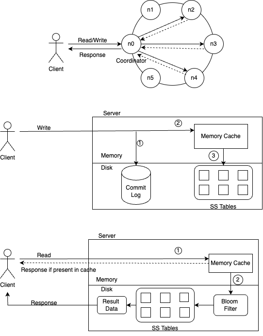

## Distributed Key Value Store System Design

### Functional Requirements
1. Key should be unique.
2. Values can be string, list or object.
3. System should support put (key, value)pair and get(key)

### Non Functional Requirements
1. Key Value pair size should be less than 10 KB.
2. High Availability: System should respond even during failures.
3. Highly Scalable: System should support large data set.
4. Low Latency: System should return value corresponding to given key with minimum latency.

### Points to discuss
- **Data Partitioning**: using consistent hashing to allow automatic scaling and heteroginity. 
- **Data Replication**: across multiple data centres.  
- **Consistency**: eventual consistency maintained using version vectors. 
- **Handling Failures**: Using gossip protocol to detect server/node is down, Tempory failure is handled through sloppy quorum -> hinted handoff, parmanent failures are handled via merkel tree. 

### API Design
1. GET /api/v1/getValye?key=?
2. POST /api/v1/put 
    RequestBody:  {key:xxx, value:xxx}

### Database Design
1. Memory Cache : to store data during writes,and flush to database once cache is full
2. Sorted string Table (SS Tables): It is used for persistent key value storage in nodes
3. Bloom Filter : It is used to search which SS table contains the key.

### System GoThrough
> **Overall Architecture**
> - Clients communicate with key value store via APIs
> - Coordinator node act as proxy between client and store
> - Nodes are distributed on a ring using consistent hashing, decentralised system allows automatic scaling and data is relicated on multiple node both at same centres as well as in multiple data centres ensuring no single point of failure.

> **Write Path on reaching a specific node**
> - Write request is persisted on commited log file.
> - Data is saved in memory cache.
> - when memory cache is full, data is flushed to SSTable.

> **Read Path on reaching a specific node**
> - If key is present in memory cache, it returs the result.
> - Else it checks in bloom filter which directs to SSTable containing the key which then returns the result.

