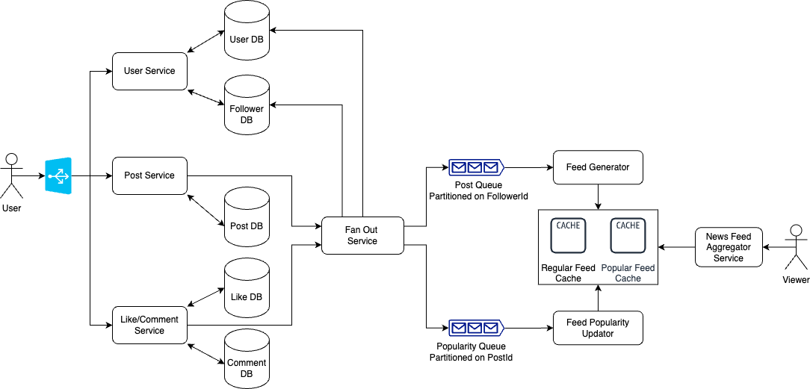

## News Feed System Design

### Functional Requirements
1. When a user opens app,he can publish a feed as well as see feeds of other users he follows.
2. User can like, comment on those posts.
3. These feeds can be arranged according to their popularity in reverse cronological order.
4. Instead of loading all feeds in one go, feeds can be loaded using pagination.
5. Feed can consist of media files like images, videos.

### Non Functional Requirements
1. **Scale of the system**: We can consider around 1 billion users with 25% daily active users, out of which 10% writes post => Reads >> Writes
2. **Latency**: 
- Feeds should be fetched with minimal latency as low as 500ms.
- Publishing Post should take <500 ms.
- Post visibility should be less than 2-3 minutes i.e eventually consistent. 
3. **Freshness of Feeds** : We can refresh feeds within every Hour.
4. **Reliability and Availability**:System should be highly reliable if not Users will loose interest in using the app.

### Back of Envelope Estimation
1. **Storage**: With 250 million daily active users, if 20% of them publish 2 posts per day and 1% upload 1 image per day
- Noof posts per day = 50 million * 2 = 100 million posts per day
- Average post size = 300 bytes, post storage = 300 bytes * 100 million = 30GB per day
- Average image size =  300KB,  image storage = 300 KB * 2.5 million = 7.5 TB
- Total storage = 7.5 TB + 30 GB ~ 8TB
- RAM storage : if 1 machine holds around 1 TB, 8 machines for caching

2. **QPS**: lets assume an average of 5 reads per day by daily active users 
- read queries per day = 250 million * 5 = 750 million
- QPS = 750 million/(24*60*60) ~ 9K read requests per sec
- Latency <500 ms, 1 machine has around 50 threads = 100 requests per second
- Noof servers = 90

### API Design
1. POST /api/feed/v1/post?{userId}
- Request Body:{content:xxxxx}
2. GET /api/feed/v1/get?{userId}

### Database Design
1. Regular Feed:
> - Schema: FollowerId, PosterId, PostId, ,timestamp, popularityIndex
> - NoSQL, Multi Leader Replication, Partioned by FollowerId and sorted by timestamp and popularity Index

2. Popular Feed:
> - Schema: PosterId,PostId, timestamp, popularityIndex
> - NoSQL, Partitioned by PosterId and sorted by timestamp and popularity Index

3. User DB
> - SQL, Single Leader Replication, Partitioned and indexed on UserId

4. Follower/Following DB
> - Graph Database : two types of queries here, one is getFollowers, other is getFollowing

5. Post DB
> - Schema: PosterId, PostId, Titile, content, image Link ,timestamp
> - NoSQL, Multi Leader Replication, Sharded by PosterId, partitioned and indexed on postId, sorted by timestamp

6. Likes DB
> - Schema: PostId, userId ,upvote, timestamp
> - MySQL, Single Leader Replication, Sharded by PostId, sorted by timestamp

7. Comments DB (not considering nested comments)
> - Schema: PostId, userId , content, timestamp
> - MySQL, Single Leader Replication, Sharded by PostId, sorted by timestamp

### System GoThrough
1. When a user writes a post it goes from post service post API to store in PostDB,
2. Post service also sends post to fan out service which gets followers of posterId from followerDB as well as popular users list.
- if a post belongs to popular user, it is added to post queue as a popular post with posterId.
- otherwise post is added to post queue along with followers list.
3. Feed Generator consumes posts from queue, if a post belongs to a popular user then post is added to popular feed else added to regular news feed of each followerId.
4. When a user like or comment on a post, it goes to like/comment service and stored in likeDB and commentDB.
5. Like/comment service also sends updates of post likes/comments to fan out service which are further pushed to popularity queue, then consumed by feed popularity updator, and updates regular feed DB and popular feed Db
6. When any user enters the app to read news feed he will get already prepared feeds from regular feeds DB and popular feeds of all popular users he follows from news feed aggregator service.

