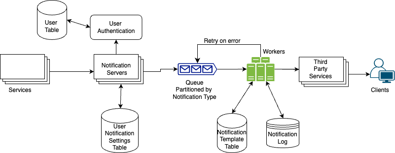

## Notification Service System Design

### Functional Requiremnts
1. Service should accept notification requests from various types of servers.
2. It should support different types of notifications like email, SMS, Whatsapp, push notifications.

### Non Functional Requiremts
1. Scalability: System should be able to handle 1 million notification per day
2. Idempotence: System should be able to send notifications exactly once to the client.
3. Fault Tolerant

### API Design
1. POST /api/v1/send?{notification-type}
- Request Body:{messsage: xxxx, userId:xxxx}

### Database Design
1. **User Notification Settings Table**:  Relational DB, Single Leader Replication, Partitioned by UserId
> - UserId: int
> - Notification Type: { email/sms/whatapp/push}
> - OptIn :bool

2. **Notification Log Table**: Cassandra, Multiple Leader Replication, Partioned By TopicId and Indexed By Timestamp
> - NotificationId: int
> - Status:{pending, failed, completed}
> - Retries left: int
> - Last Sent At: timestamp
> - Message: string
> - Notification Type: { email/sms/whatapp/push}
> - TopicId: string

3. **Template Table**: Key Value
> - TemplateId : int 
> - template: string
> - createdAt: timestamp

### Handle Idempotency
> Use idempotency key for each notification eventId to avoid sending duplicate notifications on client device, if received acknowledgement from client end notification is successfully sent otherwise sent again.

### System Go Through
1. A service calls APIs provided by notification servers to send notifications.
2. The notification servers first authenticate user info and check rate-limit per user.
3. Notification servers fetch metadata such as user info, device token, and notification setting from the cache or database.
4. A notification event is sent to the corresponding queue for processing. For instance, an iOS push notification event is sent to the iOS PN queue.
5. Workers pull notification events from message queues.
6. Workers send notifications to third party services.
7. If worker fails to send notifications, they are put back in the messaging queue and the workers will retry for a predefined number of times.
8. Third-party services send notifications to user devices.

