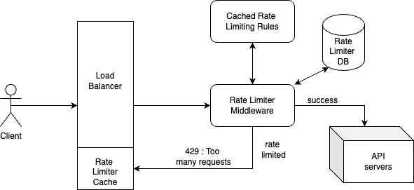

## Rate Limiter

### Functional Requirements:
1. Rate limiter should be able to stop malicious users from using our system resources by sending excessive requests within a time frame.
2. System should be able configure API rate limit either at userId or Ip address.
3. Multiple rate limiting algorithms should be supported based on API requirements like token bucket, leaky bucket, sliding window…
4. User should be informed properly, show clear exceptions if request is throttled i.e Request Status 429.

### Non Functional Requirements:
1. Highly Scalable: Rate limiter should handle high traffic of requests at a given time, around 1 billion users. 
2. Low Latency: Rate limiting should not slow down HTTP response time.
3. High fault tolerance: If rate limiter goes down, it should not impact the system.
4. Both reads and writes should be as fast as possible. 

### Points To discuss
1. **RateLimit On userID or IPAddress**: For authenticated users, use UserId otherwise use IPAddress
2. **RateLimiter Position**: Depends on system usecase, better to create dedicated distributed rate limiter service
> Pros: putting rate limiter locally on each microservice will use their resources and also tightly coupled with microservice (problem with scaling up and dowm) 
> Cons: Extra networking calls to rate Limiter
3. **Load Balancer as cache for Rate Limiter**: Use load balancer as write back cache( partial rate limiter) once user reaches a certain threshold( this approach is not good for active-active load balancer)
4. **Rate Limiter Algorithms**: 
> - **Token Bucket**: Here Capacity of bucket and Refiller i.e X counters per min are dynamically managed by config, implemented through counter. 
> - **Leaky Bucket**: Here requests are processed at a constant rate, implemented via Queue, Not good for handling bursty traffic 
> - **Fixed Window counter**: Here Fixed window and counter are dynamically managed by config, It can have double maximum no.of requests in a fixed window. 
> - **Sliding window log**: Here each request timestamp is logged, Implemented via linked list. 
> - **Sliding window counter**: Hybrid of fixed window counter and sliding window log

### Rate Limiter Interface Design
> bool rateLimit(long userId, string ipAddress, string serviceName, string api, date requestTime)

### Database Design
> Inmemory Cache: Use of Redis/Memcache 
> Single Leader Replication for consistent writes 
> Partioned by UserId or IPAddress (depending on rateLimiting rules)

### System Gothrough
- Rate limiting rules are stored on disk which are frequently cached.
- When a client sends request to system, load balancer first sends it to rate limiter.
- Rate limiter fetches rules from cache as well as counter and last requested timestamp from DB, then if request is not rate limited, it is sent to API servers otherwise 429:too many requests response returned to client.  
- Load balancer can be used as a partial rate limiter if a user has crossed a certain threshold, his info is stored at load balancer and request is returned from load balancer layer only.

