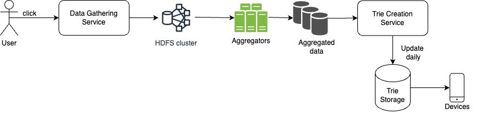

## Design Typeahead Suggestion System
Typeahead suggestion by Google keyboard, samsung keyboard used in mobiles during typing : single word auto suggestion corresponding to text input by keyboard, algorithmic problem solved by trie search

### Functional Requirements
1. System should be able to load top k suggestions relevant to input text.
3. Top terms list should be updated at least once per day.

### Non Functional Requirements
1. **Fast response time** i.e Minimal Read Latency : As a user types an input, autocomplete suggestions must show up fast enough
2. **Relevant**: Autocomplete suggestions should be relevant to the search term.
3. **Sorted**: Results returned by the system must be sorted by popularity or other ranking models.

### Back of Envelope Estimation
- There are around 200k words in english with average length of 5 characters -> to store counts per search term: 200k * 4 bytes = 800k
- To store prefix for each word ->(5*200k) = 1 million entries
- 1 million * (5 bytes for word  + 15 bytes for suggestions) = 20 MB -> can be easily stored on client's device

### Design Approaches
1. **Local Non Caching Approach:** 
- Store sorted/ordered hashmap of words with counts,
- when user types a word, query hashmap to get all words with same prefix as query using binary search
- then find top k suggestions using min heap of size k
- very slow computation : Search Complexity -> O(nlogk)

2. **Local Caching Approach:**
- Store sorted map of prefix to its top k suggestions
- Search Complexity -> O(len(prefix))
- Memory footprint wrt to each term -> O(n^2) to store all prefixes

3. **Trie Approach:**
- Store Trie of words such that each node stores top k suggestions of that prefix
- Traversing the prefix via trie takes O(1) time i.e when user type next character, getting suggestion takes O(1) time so jumping from one search term to another takes constant time.
- Memory footprint wrt to each term -> O(n)
- Using dictionary compression for popular words, creating map from short type(2 bytes) reduces storage of suggested words at each node
- Trie can be stored inmemory for faster reads
- **Problem with writes/updates**:
> - Updating a trie in real time will be quite complex because if a single write turns a node(word) into popular ones, it needs to be propagated all the way up the tree. 
> - Also all writes needs to be refected on every client device, so better to replace the trie with new one with all writes/updates once per day. 
> - Steps -> When a user clicks a word, upload that action to HDFS and then once a day run a spark job to compute top suggestions for each prefix, once done create a new trie and send it to all client devices.

