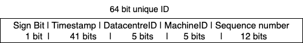

## Distributed UniqueId Generator

### Functional Requirements:
1. ID should be unique, numeric and sortable.
2. ID should be increasing with timestamp or date.
3. ID should fit in 64 bit.
4. System should be able to generate 10000 unique IDs per second.

### Non-Functional Requirements:
1. **Highly Scalable**: System should support multiple data centres and in each datacentres multiple servers generating unique IDs.
2. **Highly Available and Reliable**: As Id plays an important role in application, it should be highly available and reliable to proceed other application tasks.

### Points to discuss
> **Multi master replication**: auto increment feature of database increasing ID by k(no of database servers)
> - not good in case of multiple data centres, IDs dont increment with time, issue with servers added or removed. 
> **UUID**: 128 bit length, simple to generate and independent of other servers, easily scaled, low probabilty of collision
> - cannot be sorted wrt time, non numeric. 
> **Ticket server**: using centralized single server for generating unique numeric IDs
> - Single point of failure

### Best Approach - Twitter snowflake Approach
> 64 bits divided into 5 parts: Sign Bit, Timestamp bits, DatacentreID bits, MachineId bits, Sequence number bits

