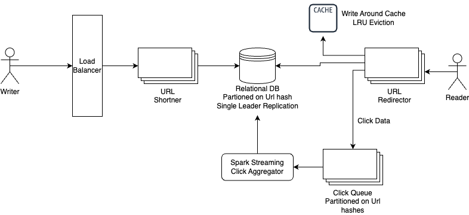

## Url Shortner System Design

### Functional Requirements
1. **URL Shortening**:Given an original long URL, return a short URL.
2. **URL Redirection**: Short Url should redirect to original URL.
3. **Analytics**: User should be able to see noof clicks on the shorten URL.

### Non Functional Requirements
1. Scale: There can be around 1 trillion links to store.
2. Reads to Writes Ratio => 10:1, Reads>> Writes
3. Highly Available: System should be highly available otherwise user will not be able to access a link.
4. Concurrent clicks: System should be able to handle concurrent clicks count. Also popular URLs can have millions of clicks.

### Back of Envelope Estimation:
- Writes: 100 million writes per day
- Writes per second = 100 million /24*360 = 1160
- Reads per second = 10*1160 = 11600
- Average Url Length = 100 bytes
- Total storage = 1 Trillion * 100 bytes = 100 TB

### Points to discuss
> **Url Shortening** : hash function can be used
> - Hash length: hash value consist of [0-9,a-z,A-Z] so, 10+26+26 = 62^n >= 1 trillion => n=7
> - Use of in built hash functions like md5, SHA-1, CRC32 : problem of hash collision as well as length of hash is quite large.
> - **Base62 Conversion**: Use a unique Id generator for each long Url and convert that id into base 62. 

### API Design
1. POST /api/v1/data/shorten
- Request Parameter {longUrl: URL string}
- return short URL

2. GET /api/v1/shortURL
- Returns long URL with http redirect response code 
- 301: permanent redirect, browser cache response
- 302: temporary redirect

3. GET /api/v1/count/shortURL
- Returns count analytics of how many times this url has been accessed or clicked.

### Database Design
1. **Schema**: UniqueID, longURL, shortURL, userId, createTime, expireTime, clicks
2. Single Leader Replication to avoid collisions 
3. Data Partitioning based on range of shortURL, hashes support even partitioning
4. B+ tree index based on faster reads

### Cache Design
1. Hot Links can be cached for faster reads
2. Populating Cache through write around cache + LRU eviction

### Analytics Discussion
1. Push click info on log based message broker -> Kafka partitioned on shortUrl
2. Clicks can be then aggregated using spark streaming consumer -> mini batch updates on DB
3. Ensure idempotent updates on database : idempotency keys can be used here to avoid grabing locks

### System GoThrough
> **Url Shortening**
> - Client enters a long URL.
> - System checks if long Url present in DB, if yes returns the corresponding short Url.
> - Otherwise generate a unique ID, convert it to short URL using base62 conversion.
> - Write this entry to database and returns the short URL to client.

> **Url Redirection**
> - Client clicks the short URL. 
> - System checks if short Url present in cache, if yes returns the corresponding long Url.
> - Otherwise fetch long URL from database, and returns to client.

