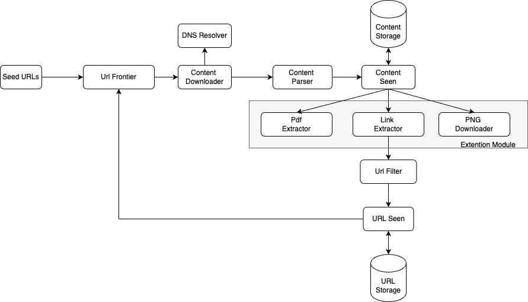
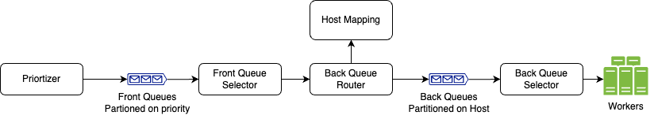

## Web Crawler System Design

### Functional Requirements
1. Given some seed URLs, extract content and other url links from them and further crawl them.
2. System should be able to prioritize Urls.
3. It should follow crawling policies per host i.e Robots.txt
4. Avoid Duplication : About 30% of content on web is duplicate, avoid storing duplicate content.

### Non Functional Riquirements
1. **Scalability**: System should be able to crawl billions of pages per month, It should be able to crawl web pages in parellelism
2. **Robustness**: System should handle bad HTML, unresponsive servers, crashes, malicious links etc all the edge cases.
3. **Extensible**: System should be extendible to crawl different types of content likes images, videos, PDFs etc.

### Back Of Envelope Estimation
1. No.of web pages to crawl per month = 1 billion
2. QPS = 1 billion/ 30 days /24 hours / 3600 secons = 400 pages per second
2. Average page size = 500 KB
3. Storage required = 1 billion * 500 KB = 500 TB per month -> for 5 years => 500TB * 60 = 30 PB

### Database schema
1. URL data Table
> - URL link: string
> - status: enum(done,pending)
> - last Crawled : Date
> - content Type: enum(HTML, image, pdf)
> - content size: in KB
> - URL host/ domain : string

2. Content Table
> - Url link: string
> - title: string
> - keywords: []string
> - text content: string

3. Links Table
> - source URL: string
> - Target URL : string
> - Anchor text: string
> - Link Type: internal or external

4. Host Mapping Table
> - HostName : string
> - Ip Address: string
> - Last crawled: timestamp 
> - Next Allowed Crawled: timestamp

### Design Components
1. **URL Frontier**: It maintains the URLs to be crawled and manages their priortization and host politeness by following their robots.txt policies.
2. **DNS Resolver + Cache**: It is used to get IP address of Url host, to reduce DNS requests latency cache is maintained.
3. **Content Downloader**: This component downloads the content from URL. Multiple workers are used for distributed crawl jobs.
4. **Content Parser <-> Content Storage**: It parses the downloaded content to avoid problems due to malformed web pages.
4. **Link Extractor**:It extract links from the parsed content.
5. **Url Filter <-> Url Storage**: It is used to filter out invalid and blacklisted links and then stores the crawled url link to Url storage

### URL Frontier
**Priortizer-> Front Queues -> Front Queue Selector -> Back Queues Router -> Back Queues -> Back Queues Selector -> Workers** 

### System GoThrough
1. Seed Urls are passed to Url Frontier.
2. In Url Frontier, following process takes places:
> - first priortize the given urls 
> - then push to front queues based on priority
> - from there front queue selector pick random Urls based to priority
> - Futher pass to back queue router which maps the url to back queue based on host using host mapping table
> - Then pushed to back queues 
3. Urls are picked by Content Download workers from back queues.
4. Content Downloader gets IP addresses of URLs from DNS resolver and starts downloading.
5. Content Parser parses HTML pages and checks if pages are malformed.
6. After content is parsed and validated, it is passed to the “Content Seen?” component.
7. “Content Seen” component checks if a HTML page is already in the storage using hash of content.
> - If it is in the storage, this means the same content in a different URL has already been processed. In this case, the HTML page is discarded.
> - If it is not in the storage, the system has not processed the same content before. The content is passed to Link Extractor.
8. Link extractor extracts links from HTML pages.
9. Extracted links are passed to the URL filter.
10. After links are filtered, they are passed to the “URL Seen?” component.
11. “URL Seen” component checks if a URL is already in the storage
> - if yes, it is processed before, and nothing needs to be done.
> - If a URL has not been processed before, it is added to the URL Frontier.

