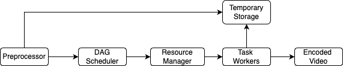

## Youtube System Design

### Functional Requirements
1. User should be able to upload a video.
2. Viewers can watch, like and comment on videos.
3. Videos can be searched by name.

### Non Functional Requirements
1. System should support different types of video quality and client devices both at uploading videos and watching them.
2. High availability, scalability, and reliability requirements
3. Users watching videos is much more compared to uploading videos -> Reads >> Writes

### Back of Envelope Estimation
1. Daily active users = 5 million with each user watching 5 videos per day on average and 10%of users upload 1 video per day.
2. average video size = 300MB
3. Daily storage = 5 million * 10% * 300 MB = 150TB

### API Design
1. Video Uploading flow
- POST /api/v1/video/upload
- upload video metadata and chunks of video

2. Video Streaming flow
- GET /api/v1/video/get/details
- return video metadata

### Database Design
1. SubscribersDB
- Schema -> {userId, subscribedTo}
- Graph Database : two types of queries here, one is getSubscribers, other is getSubscribedTo : Shard, Index and partition on userId

2. VideoDetailsDB
- Schema -> {userId, videosId, timestamp, videoName, description}
- MySQL: Shard by userId to get all videos of a user on single node
- Partitioned by userId, sort by userId + videoId + timestamp

3. UserDB
- Schema -> { userId, name, email, passwordHash ...}
- MySQL: partioned + index on userId

4. VideoCommentsDB
- Schema -> {channelId, videoId, timestamp, userId, comment}
- Cassandra: Partioned on channelId + videoId + timestamp

5. VideoChunkMetadataDB
- Schema -> {videoId, encoding, resolution, chunkOrder, hash, URL}
- MySQL: partition on videoId to get all chunks of video on same node
- sort by videoId, encoding, resolution, chunkOrder

6. VideoChunk Storage
- A blob storage system is used to store original videos as well as transcoded videos
- S3: less expensive, option2 can be HDFS: offers better data locality but expensive

### Video Uploading Flow
The flow is broken down into three processes running in parallel.
1. **Upload the actual video**: Uploading a video as a whole unit is inefficient. We can split a video into smaller chunks by GOP alignment. This allows fast resumable uploads when the previous upload failed. The job of splitting a video file by GOP can be implemented by the client to improve the upload speed
2. **Update video metadata** : Metadata contains information about video URL, size, resolution, format, user info, etc.
3. **Upload video to CDN**: Popular videos (of channels with millions of subscribers) are uploaded to CDN. 

The video uploading steps are as follows:
> 1. Videos are uploaded to the original storage.
> 2. Transcoding servers fetch videos from the original storage and start transcoding.
> 3. Once transcoding is complete, the following two steps are executed in parallel:
>   + Transcoded videos are sent to transcoded storage. Then transcoded videos are distributed to CDN
>   + Transcoding completion events are queued in the completion queue. Completion handler contains a bunch of workers that continuously pull event data from the queue.
> 4. Completion handler updates the metadata database (chunks metadata and video metadata) and cache when video transcoding is complete.
> 5. API servers inform the client that the video is successfully uploaded and is ready for streaming.
> 6. Upload popular videos to CDNs. Use push based approach for popular ones and pull based approach for others.

### Video Transcoding
The original video is split into video, audio, and metadata. Here are some of the tasks that can be applied on a video file:
- Inspection: Make sure videos have good quality and are not malformed. 
- Video encodings: Videos are converted to support different resolutions, codec, bitrates, etc.
- Thumbnail: Thumbnails can either be uploaded by a user or automatically generated by the system.
- Watermark: An image overlay on top of your video contains identifying information about your video.

### Video Transcoding Architecture

1. **Preprocessor**: The preprocessor has 4 responsibilities:
- Video splitting: Video stream is split or further split into smaller Group of Pictures (GOP) alignment. GOP is a group/chunk of frames arranged in a specific order. Each chunk is an independently playable unit, usually a few seconds in length.
- Some old mobile devices or browsers might not support video splitting. Preprocessor split videos by GOP alignment for old clients.
- DAG generation: The processor generates DAG based on configuration files client programmers write.
- Cache data: The preprocessor is a cache for segmented videos. For better reliability, the preprocessor stores GOPs and metadata in temporary storage. If video encoding fails, the system could use persisted data for retry operations.

2. **DAG Scheduler**: The DAG scheduler splits a DAG graph into stages of tasks and puts them in the task queue in the resource manager. The original video is split into three stages:
- Stage 1: video, audio, and metadata.
- The video file is further split into two tasks in stage 2: video encoding and thumbnail. 
- The audio file requires audio encoding as part of the stage 2 tasks.

3. **Resource Manager**: The resource manager is responsible for managing the efficiency of resource allocation. It contains 3 queues and a task scheduler.
- Task queue: It is a priority queue that contains tasks to be executed.
- Worker queue: It is a priority queue that contains worker utilization info.
- Running queue: It contains info about the currently running tasks and workers running the tasks.
- Task scheduler: It picks the optimal task/worker, and instructs the chosen task worker to execute the job.

The resource manager works as follows:
> - The task scheduler gets the highest priority task from the task queue and gets the optimal task worker to run the task from the worker queue. 
> - Then it instructs the chosen task worker to run the task. 
> - The task scheduler binds the task/worker info and puts it in the running queue. 
> - The task scheduler removes the job from the running queue once the job is done.

4. **Task Worker**: Task workers run the tasks which are defined in the DAG. Different task workers may run different tasks like: Watermark, Encoder, Thumbnail, Merger, etc.

5. **Temporary Storage**: Multiple storage systems are used here. The choice of storage system depends on factors like data type, data size, access frequency, data life span, etc. For instance, metadata is frequently accessed by workers, and the data size is usually small. Thus, caching metadata in memory is a good idea. For video or audio data, we put them in blob storage. Data in temporary storage is freed up once the corresponding video processing is complete.

6. **Encoded Video**: Encoded video is the final output of the encoding pipeline.

### Video Streaming Flow
- To support different types of devices and different network speeds, dynamic streaming should be supported. That's why multiple encodings (for different devices) and multiple resolutions (for different network speed) were created for each video. So instead of loading the whole video at a time, chucks of video are loaded based on current network spped and given device type encoding is preferred. It ensures lower barrier to start watching a video.
- Videos are streamed from CDN directly. The edge server closest to you will deliver the video. Thus, there is very little latency.
- There is a standardized way to control data transfer for video streaming. Popular streaming protocols are:
1. MPEG–DASH. MPEG stands for “Moving Picture Experts Group” and DASH stands for "Dynamic Adaptive Streaming over HTTP"
2. Apple HLS. HLS stands for “HTTP Live Streaming”
3. Microsoft Smooth Streaming.
4. Adobe HTTP Dynamic Streaming (HDS).

### Video Search Indexing
- To get videos based on search query, Video title and description should be added to distributed search Index -> Elastic Search
- Need to store some metadata with videos otherwise we have to do a super expensive distributed query on user Videos table.
- Instead of doing term specific partitioning for popular terms (as putting all videos metadata on single node might be not possible), better to use round robin in all documents nad keep a local index per partition on fixed number of nodes.

### Optimizations
1. Speed optimizations:
- parallelize video uploading by splitting a video into smaller chunks by GOP alignment.
- place upload centers close to users using CDNs.
- parallelism in video encoding via message queues
2. Safety optimizations:
- pre-signed upload URL to allow uploading videos at right location by authorized users only.
- protect copyrights of videos by using Digital rights management (DRM) systems, AES encryption and Visual watermarking.